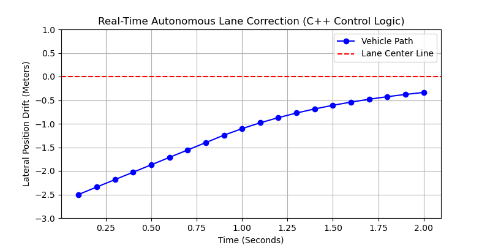

# Autonomous Lane Keeping & Vehicle Control Simulation

A multi-language Cyber-Physical System (CPS) framework exploring real-time autonomous vehicle lane-tracking control loops. This project interfaces a low-latency **C++ algorithmic brain** with a dynamic **Python physics and visualization engine**.



## System Architecture & Flow
The architecture models production autonomous systems by isolating safety-critical processing calculations from the peripheral execution runtime environments:
1. **Physics Core (`vehicle_simulator.py`)**: Models 2D kinematics using a simplified bicycle model.
2. **Controller Core (`lane_controller.cpp`)**: A high-performance tracking block using a Proportional-Derivative (PD) control loop to minimize lateral drift.
3. **Integration Bridge (`visual_bridge.py`)**: Manages continuous, real-time Inter-Process Communication (IPC) pipelines utilizing subprocess I/O parsing structures.

## Core Control Mathematics
The automated steering adjustments use a dedicated Proportional-Derivative algorithm to calculate smooth convergence trajectories:

$$\delta(t) = -\left( K_p \cdot e(t) + K_d \cdot \frac{de(t)}{dt} \right)$$

Where:
* $e(t)$ represents the current lateral drift distance from the center target line.
* $\delta(t)$ determines the safety-bounded steering correction output (clamped to $\pm30^{\circ}$).
* $K_p = 0.5$ balances immediate reactive tracking sensitivity.
* $K_d = 0.1$ dampens potential directional overshooting oscillations.

## Project Execution Map
To launch the real-time animated simulation tracking dashboard natively on Linux, execute:
```bash
sudo apt-get install python3-matplotlib
python3 visual_bridge.py
```
